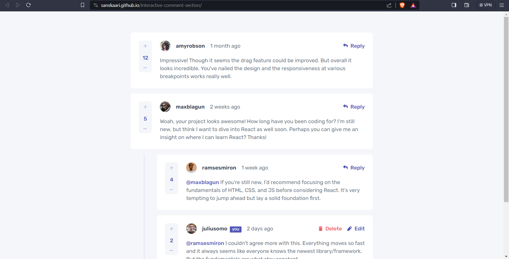
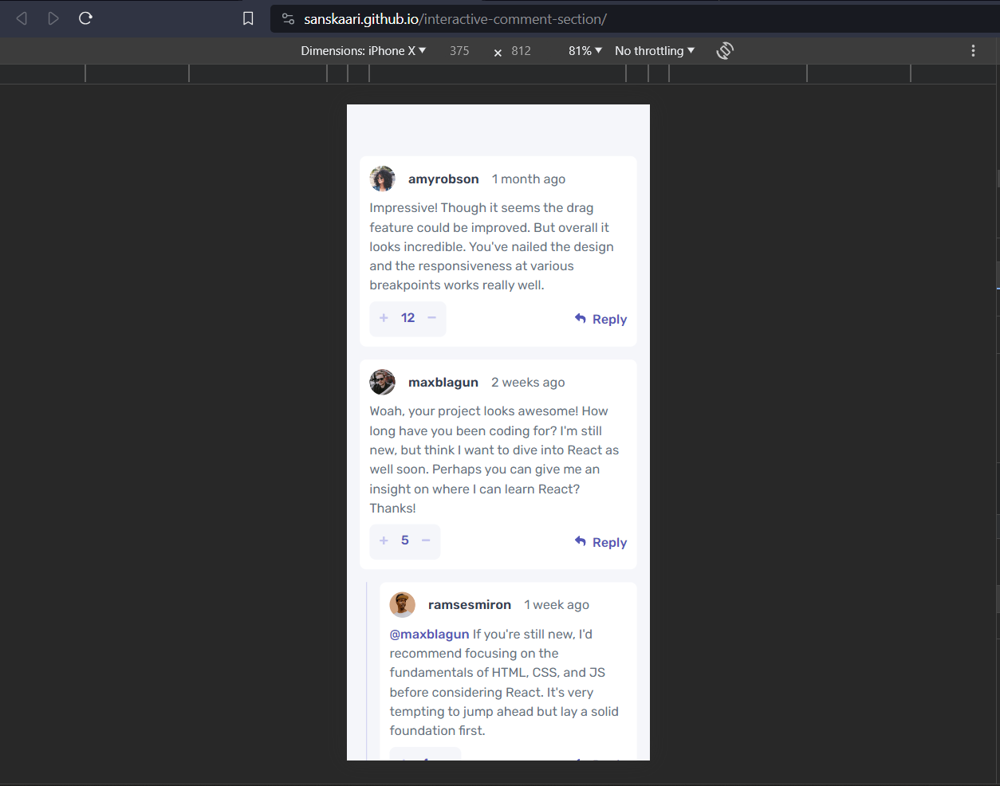

# HACKTOBER FEST 2023 WEB DEV

This is a solution to the Problem statement given in the HACKTOBERFEST 2023

## Table of contents

- [Overview](#overview)
  - [The challenge](#the-challenge)
  - [Screenshot](#screenshot)
  - [Links](#links)
- [My process](#my-process)
  - [Built with](#built-with)
  - [What I learned](#what-i-learned)
  - [Continued development](#continued-development)
  - [Useful resources](#useful-resources)
- [Author](#author)
- [Acknowledgments](#acknowledgments)

## Overview

### The challenge

Users should be able to:

- View the optimal layout for the interface depending on their device's screen size
- See hover and focus states for all interactive elements on the page
- **Bonus**: Use the local JSON data to dynamically populate the content

### Screenshot

### Links

- Live Site URL: https://sanskaari.github.io/interactive-comment-section/

## My process

### Built with

- Semantic HTML5 markup
- CSS custom properties
- Flexbox
- CSS Grid
- Mobile-first workflow
- JavaScript

### What I learned

I learned to create responsive mobile-first workflow. I also learned how to create interactive web pages.

### Useful resources

## Author

- LinkedIn - [Samar Bhatia](www.linkedin.com/in/samar-bhatia-4a82bb282)
- Twitter - [@0Sanskaari0](https://twitter.com/0Sanskaari0)
